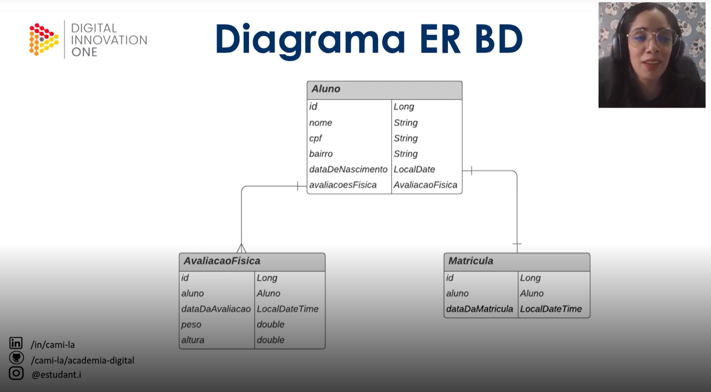
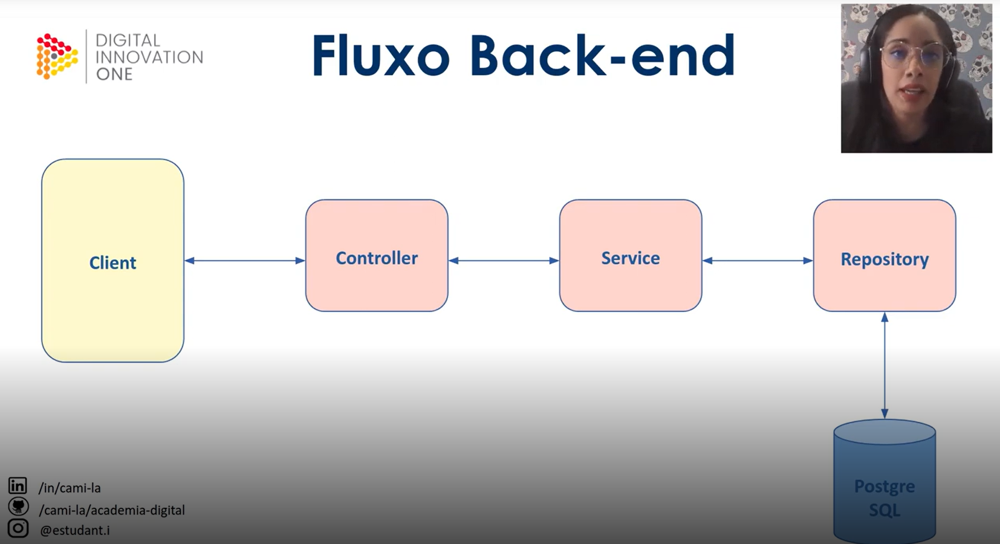

# dio-desafio-projeto-spring-data-jpa
Repositório do desafio de projeto "Conhecendo Spring Data JPA na prática com Java" do Bootcamp Banco "PAN Java Developer"

## Tecnologias utilizadas
- Java 11
- Maven
- Spring Boot (Spring Web, Spring Data JPA)
- PostgreSQL Driver
- Hibernate Validator
- Lombok

- Intellij
- Postman

- Instância do BD hospedado no serviço (PaaS) gratuito ElephantSQL (https://www.elephantsql.com/)

## Arquitetura do BD de exemplo

## Fluxo Back-end

### Desenvolvimento do desafio

1) Criado um projeto no ``spring initializr``
2) Criado o pacote 'model' com as classes que representam nossas tabelas (Aluno, AvaliacaoFisica e Matricula)
3) Criado o pacote 'model.dto' com as classes que representam os DTOs
4) Criado pacote 'service' com as interfaces e suas implemntações em 'impl'
5)